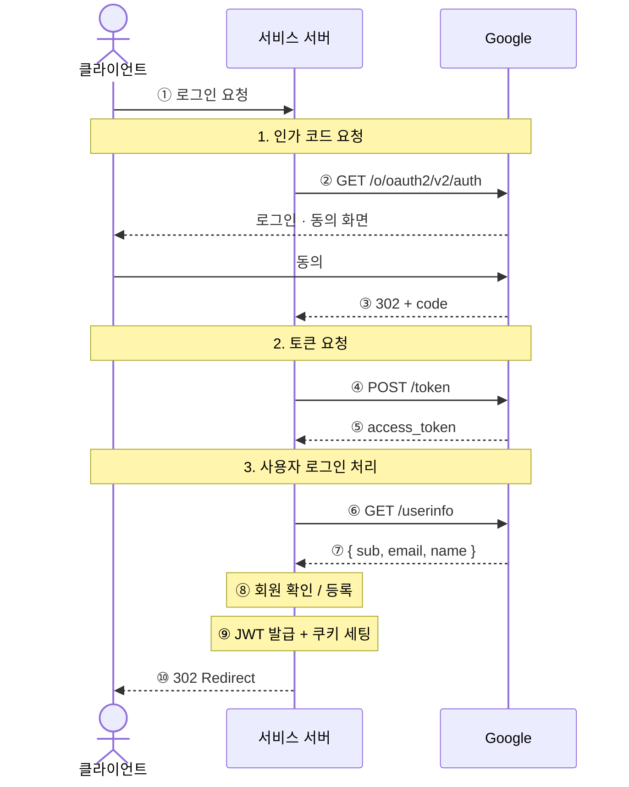
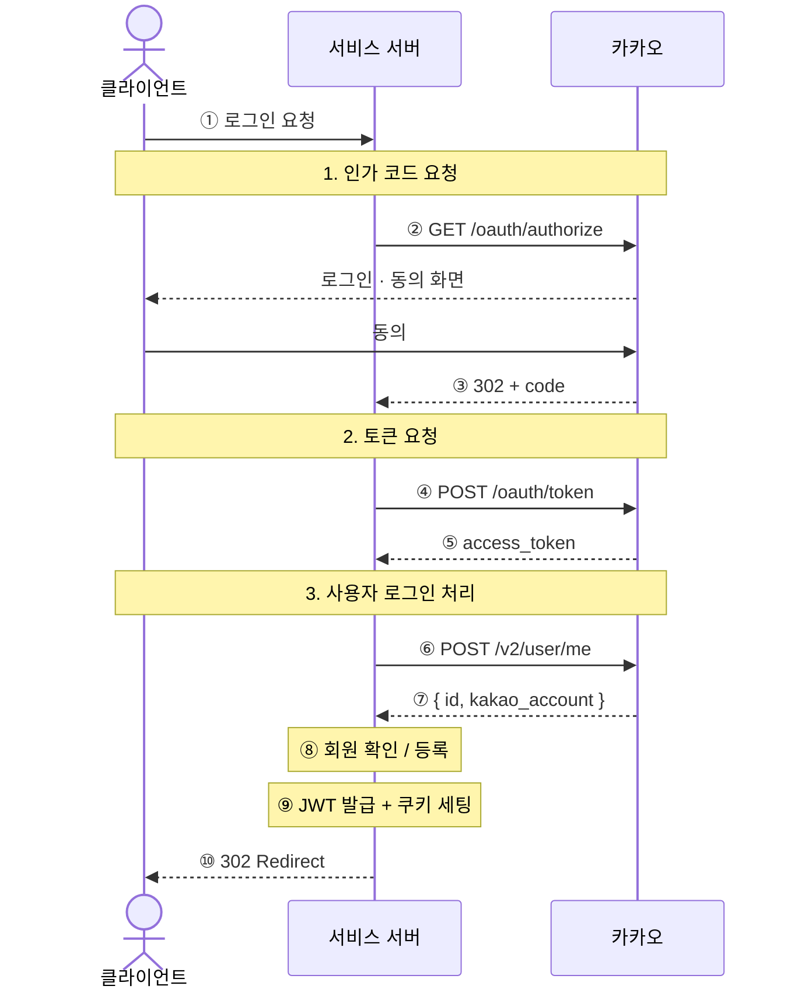
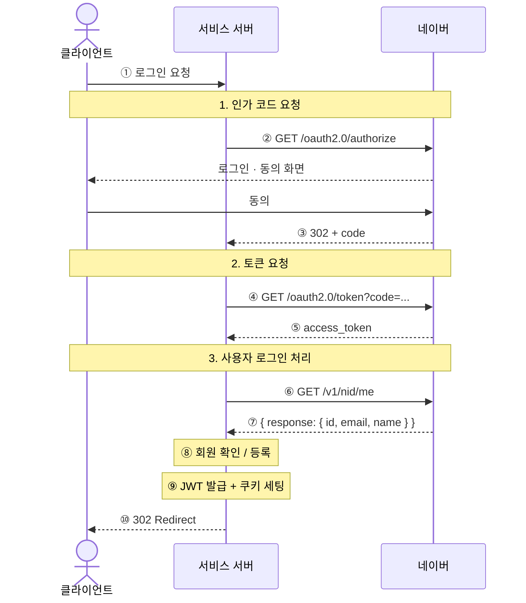

# Social Login Flows

이 문서는 현재 코드 기준의 Google, Kakao, Naver 로그인 흐름을 provider별로 정리한 것입니다.
다이어그램의 번호는 아래 **코드 연결** 표에서 실제 파일과 코드를 가리킵니다.

기준 파일:
- `backend/src/controllers/auth/social.controller.js`
- `backend/src/services/social-auth.service.js`
- `backend/src/repository/user.repository.js`
- `backend/src/providers/token.provider.js`
- `backend/src/providers/cookie.provider.js`

---

## Google



### 코드 연결

| # | 내용 | 코드 |
|---|------|------|
| ① | `GET /api/auth/social/google/login?next=/` 수신 | `social.controller.js` → `socialRedirect()` |
| ② | `accounts.google.com/o/oauth2/v2/auth` URL 빌드 후 redirect | `social.controller.js` → `socialLoginLinkGenerator.google` → `res.redirect(loginUrl)` |
| ③ | `GET /api/auth/social/callback/google?code=...&state=...` 수신 | `social.controller.js` → `socialCallback()` → `req.query.code`, `req.query.state` |
| ④ | `POST https://oauth2.googleapis.com/token` — code → access_token 교환 | `social-auth.service.js` → `#getGoogleProfile()` → `#requestSocialJson('https://oauth2.googleapis.com/token', ...)` |
| ⑤ | `tokenResponse.access_token` 추출 | `social-auth.service.js` → `#getGoogleProfile()` → `tokenResponse.access_token` |
| ⑥ | `GET https://openidconnect.googleapis.com/v1/userinfo` — 프로필 조회 | `social-auth.service.js` → `#getGoogleProfile()` → `#requestSocialJson('https://openidconnect.googleapis.com/v1/userinfo', ...)` |
| ⑦ | `{ id: sub, email, name }` 으로 정규화 | `social-auth.service.js` → `#getGoogleProfile()` 반환값 |
| ⑧ | 소셜 계정 조회 → 이메일 조회 → 생성 또는 연결 (3분기) | `social-auth.service.js` → `#resolveUser()` |
| ⑨ | JWT 생성 후 HttpOnly 쿠키로 전달 | `social-auth.service.js` → `tokenProvider.generateTokens(user)` / `social.controller.js` → `cookieProvider.setAuthCookies(res, tokens)` |
| ⑩ | state 디코딩 → next 경로 검증 → 클라이언트로 redirect | `social.controller.js` → `#decodeState()` → `#normalizeNextPath()` → `res.redirect(redirectUrl)` |

---

## Kakao



### 코드 연결

| # | 내용 | 코드 |
|---|------|------|
| ① | `GET /api/auth/social/kakao/login?next=/` 수신 | `social.controller.js` → `socialRedirect()` |
| ② | `kauth.kakao.com/oauth/authorize` URL 빌드 후 redirect | `social.controller.js` → `socialLoginLinkGenerator.kakao` → `res.redirect(loginUrl)` |
| ③ | `GET /api/auth/social/callback/kakao?code=...&state=...` 수신 | `social.controller.js` → `socialCallback()` → `req.query.code`, `req.query.state` |
| ④ | `POST https://kauth.kakao.com/oauth/token` — code → access_token 교환 | `social-auth.service.js` → `#getKakaoProfile()` → `#requestSocialJson('https://kauth.kakao.com/oauth/token', ...)` |
| ⑤ | `tokenResponse.access_token` 추출 | `social-auth.service.js` → `#getKakaoProfile()` → `tokenResponse.access_token` |
| ⑥ | `POST https://kapi.kakao.com/v2/user/me` — 사용자 정보 조회 | `social-auth.service.js` → `#getKakaoProfile()` → `#requestSocialJson('https://kapi.kakao.com/v2/user/me', ...)` |
| ⑦ | `{ id, email: kakao_account?.email, name: nickname }` 으로 정규화. nickname은 `kakao_account.profile.nickname` → `properties.nickname` 순으로 fallback | `social-auth.service.js` → `#getKakaoProfile()` 반환값 |
| ⑧ | 소셜 계정 조회 → 이메일 조회 → 생성 또는 연결 (3분기) | `social-auth.service.js` → `#resolveUser()` |
| ⑨ | JWT 생성 후 HttpOnly 쿠키로 전달 | `social-auth.service.js` → `tokenProvider.generateTokens(user)` / `social.controller.js` → `cookieProvider.setAuthCookies(res, tokens)` |
| ⑩ | state 디코딩 → next 경로 검증 → 클라이언트로 redirect | `social.controller.js` → `#decodeState()` → `#normalizeNextPath()` → `res.redirect(redirectUrl)` |

---

## Naver



### 코드 연결

| # | 내용 | 코드 |
|---|------|------|
| ① | `GET /api/auth/social/naver/login?next=/` 수신 | `social.controller.js` → `socialRedirect()` |
| ② | `nid.naver.com/oauth2.0/authorize` URL 빌드 후 redirect | `social.controller.js` → `socialLoginLinkGenerator.naver` → `res.redirect(loginUrl)` |
| ③ | `GET /api/auth/social/callback/naver?code=...&state=...` 수신 | `social.controller.js` → `socialCallback()` → `req.query.code`, `req.query.state` |
| ④ | `GET https://nid.naver.com/oauth2.0/token?${tokenQuery}` — Kakao·Google과 달리 **GET 쿼리 파라미터 방식** | `social-auth.service.js` → `#getNaverProfile()` → `#requestSocialJson('https://nid.naver.com/oauth2.0/token?...', ...)` |
| ⑤ | `tokenResponse.access_token` 추출 | `social-auth.service.js` → `#getNaverProfile()` → `tokenResponse.access_token` |
| ⑥ | `GET https://openapi.naver.com/v1/nid/me` — 사용자 정보 조회 | `social-auth.service.js` → `#getNaverProfile()` → `#requestSocialJson('https://openapi.naver.com/v1/nid/me', ...)` |
| ⑦ | `payload.response`로 한 겹 감싼 구조. `{ id, email, name }` 추출. name은 `name` → `nickname` → `email` 순으로 fallback | `social-auth.service.js` → `#getNaverProfile()` → `profilePayload.response` |
| ⑧ | 소셜 계정 조회 → 이메일 조회 → 생성 또는 연결 (3분기) | `social-auth.service.js` → `#resolveUser()` |
| ⑨ | JWT 생성 후 HttpOnly 쿠키로 전달 | `social-auth.service.js` → `tokenProvider.generateTokens(user)` / `social.controller.js` → `cookieProvider.setAuthCookies(res, tokens)` |
| ⑩ | state 디코딩 → next 경로 검증 → 클라이언트로 redirect | `social.controller.js` → `#decodeState()` → `#normalizeNextPath()` → `res.redirect(redirectUrl)` |

---

## ⑧ #resolveUser 3분기 상세

세 provider 모두 동일한 로직입니다. (`social-auth.service.js` → `#resolveUser()`)

```
소셜 계정(provider + providerId)으로 유저 조회
    │
    ├─ 있음 → ① 이름이 없으면 업데이트 후 반환
    │
    └─ 없음 → 이메일로 유저 조회
                  │
                  ├─ 없음 → ② createWithSocialAccount() — 새 유저 + 소셜 계정 생성
                  │
                  └─ 있음 → ③ connectSocialAccount() — 기존 유저에 소셜 계정 연결
```

> 이메일 미제공 시 (카카오 이메일 미동의 등) `provider_socialId@social.local` 형태의 가상 이메일을 생성합니다.
> (`social-auth.service.js` → `#resolveEmail()`)
