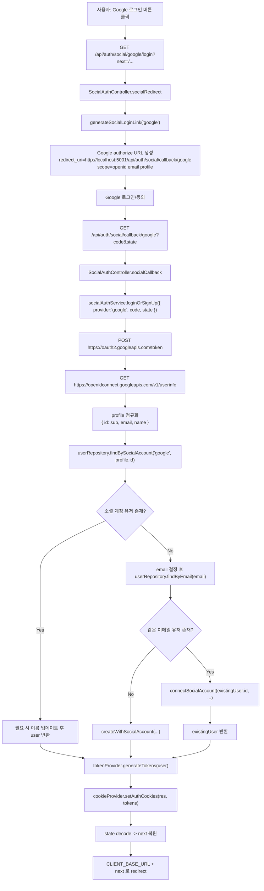
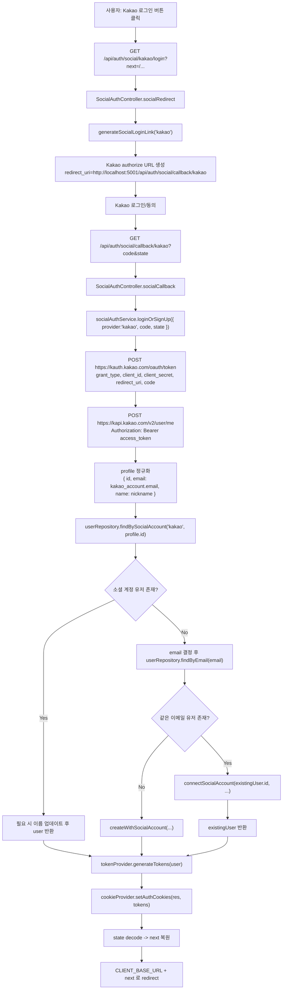
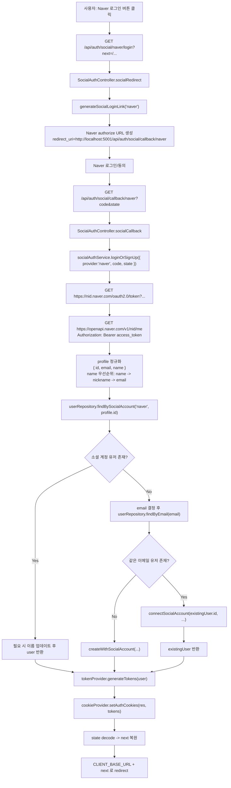

# Social Login Flows

이 문서는 현재 코드 기준의 Google, Kakao, Naver 로그인 흐름을 provider별로 분리해 정리한 것입니다.

기준 파일:
- `backend/src/controllers/auth/social.controller.js`
- `backend/src/services/social-auth.service.js`
- `backend/src/repository/user.repository.js`
- `backend/src/providers/token.provider.js`
- `backend/src/providers/cookie.provider.js`

## Google

## Kakao

## Naver

